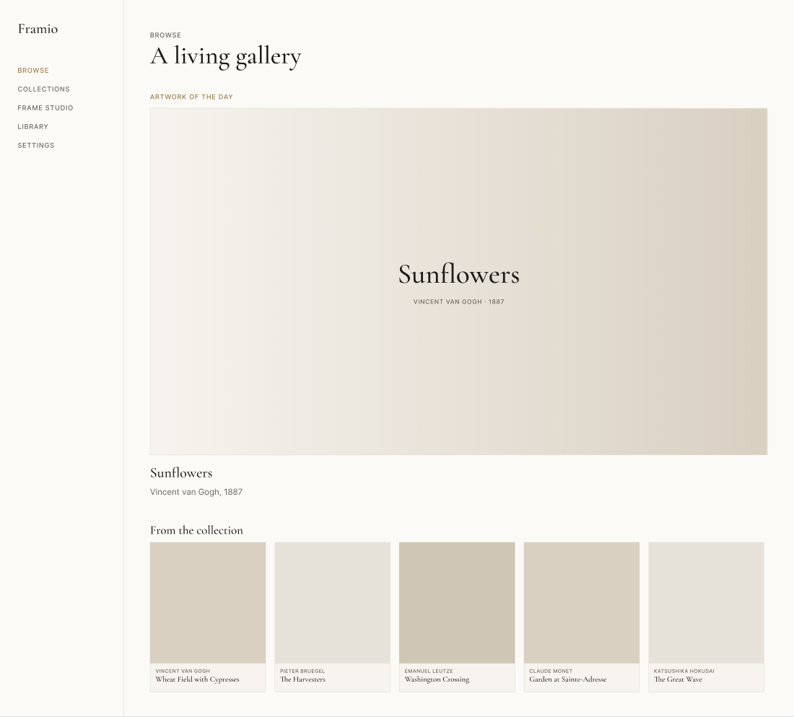
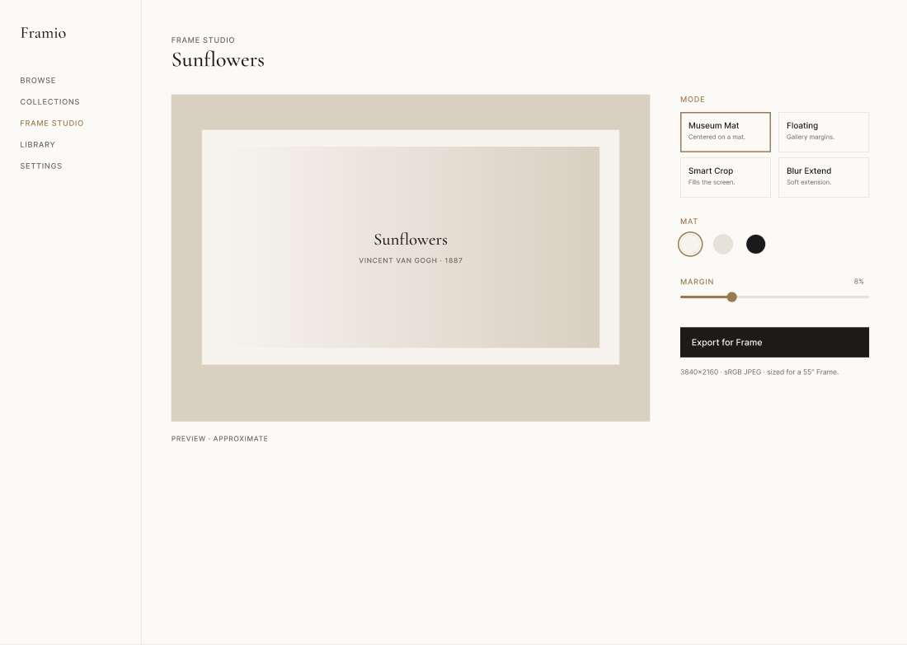

# Framio — Design

Visual mockups of the hero screens, in the Framio design language (see
[`../docs/BRANDING.md`](../docs/BRANDING.md)).

## Figma

**File:** [Framio — Mockups](https://www.figma.com/design/JCv7dpgRdXAAJNai90oQgP) · team *Projects*

Frames: **Browse — Desktop** · **Artwork Detail — Desktop** · **Frame Studio — Desktop** ·
**Browse — Mobile**.

## Snapshots

> **Note on the placeholder art.** The static mockups use captioned placeholders in the artwork
> areas — this Figma plugin bridge can't fetch remote images (`createImageAsync` is unsupported and
> `createImage` rejects external JPEGs). The **running app renders real Met artwork**: Browse pulls
> live Met data and Frame Studio exports true 3840×2160 files (both verified). The mockups exist to
> lock the visual language — palette, type, spacing, and components — not to preview pixels the app
> already produces.
