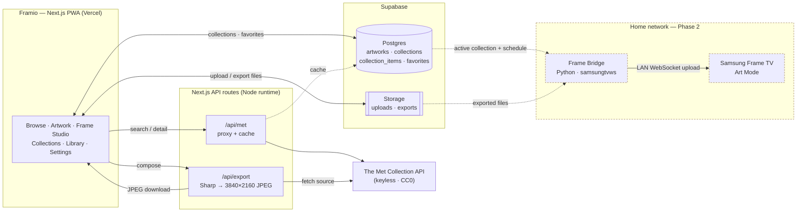
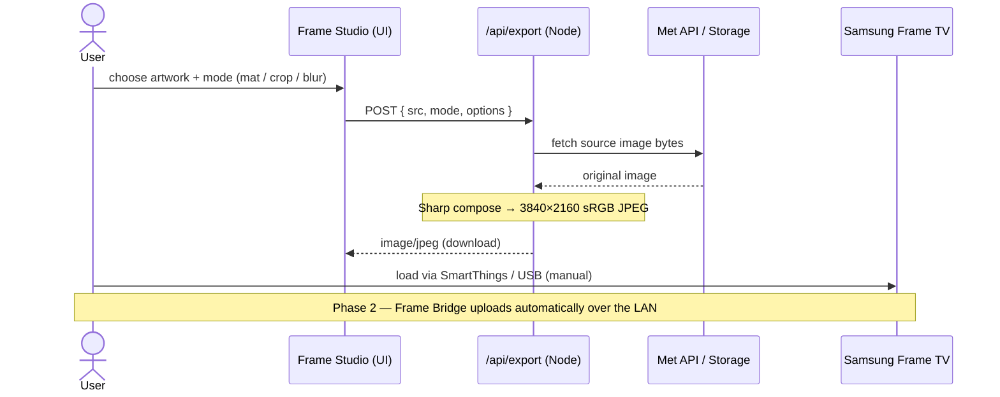
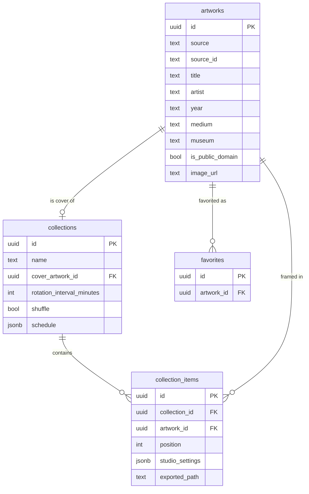

# Framio — Diagrams

GitHub renders the Mermaid blocks below directly. Source of truth for the structures they describe:
[`../ARCHITECTURE.md`](../ARCHITECTURE.md).

---

## 1. System architecture

Browse hits the Met API live; persistence and files live in Supabase; Frame Studio composes 4K files
in a Node API route. The dashed **Home network** group (Frame Bridge → TV) is **Phase 2**.

## 2. "Export for Frame" — sequence (MVP)

No Samsung API is touched. Framio makes the file; the human is the transport. Phase 2 automates the
last step via the Frame Bridge.

## 3. Data model

`artworks` is the canonical record for both Met works and user uploads. Uploads are simply
`source = 'upload'` rows; binaries live in Supabase Storage.

